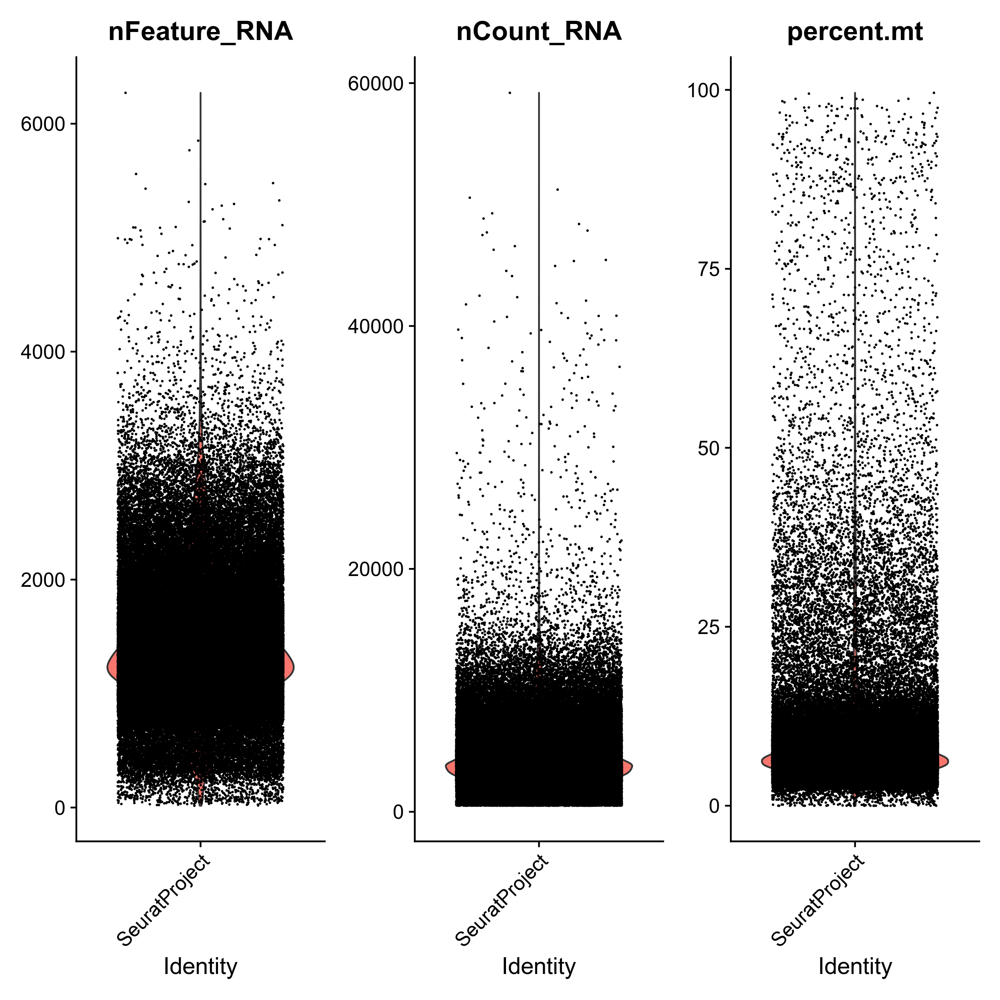
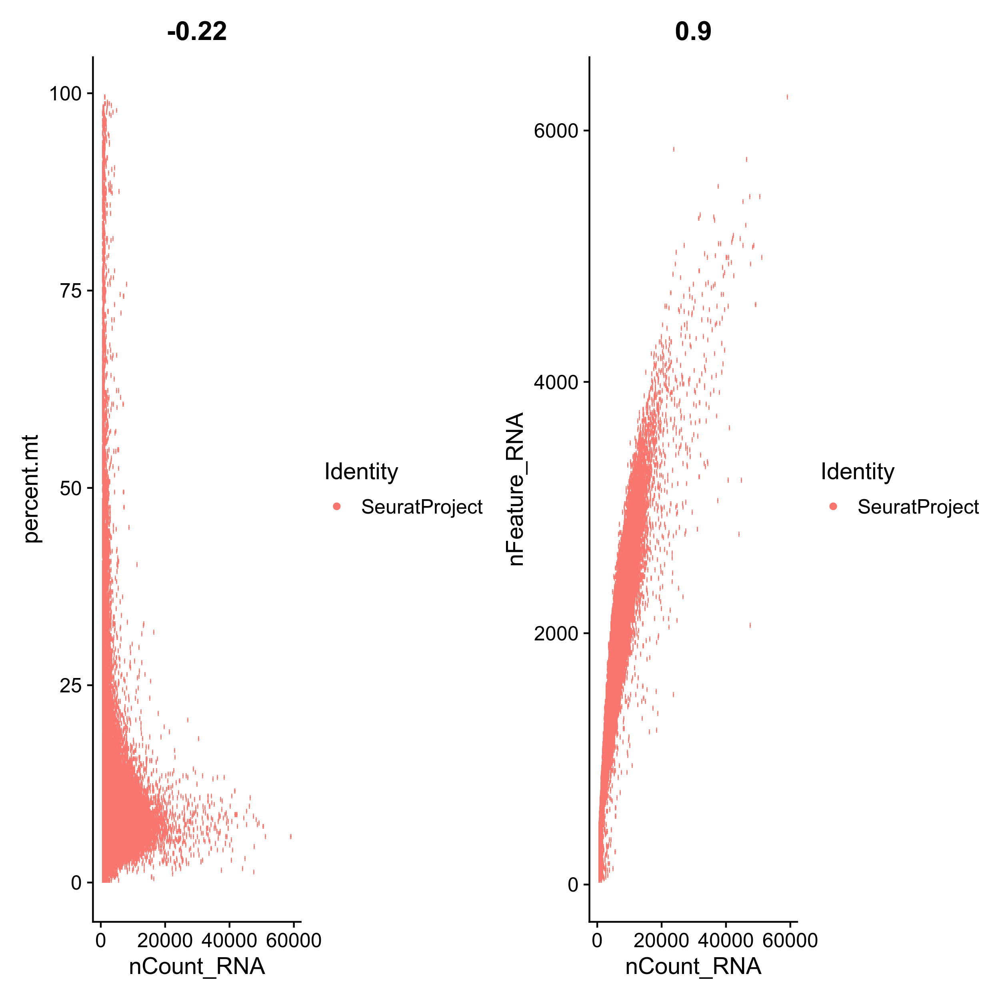
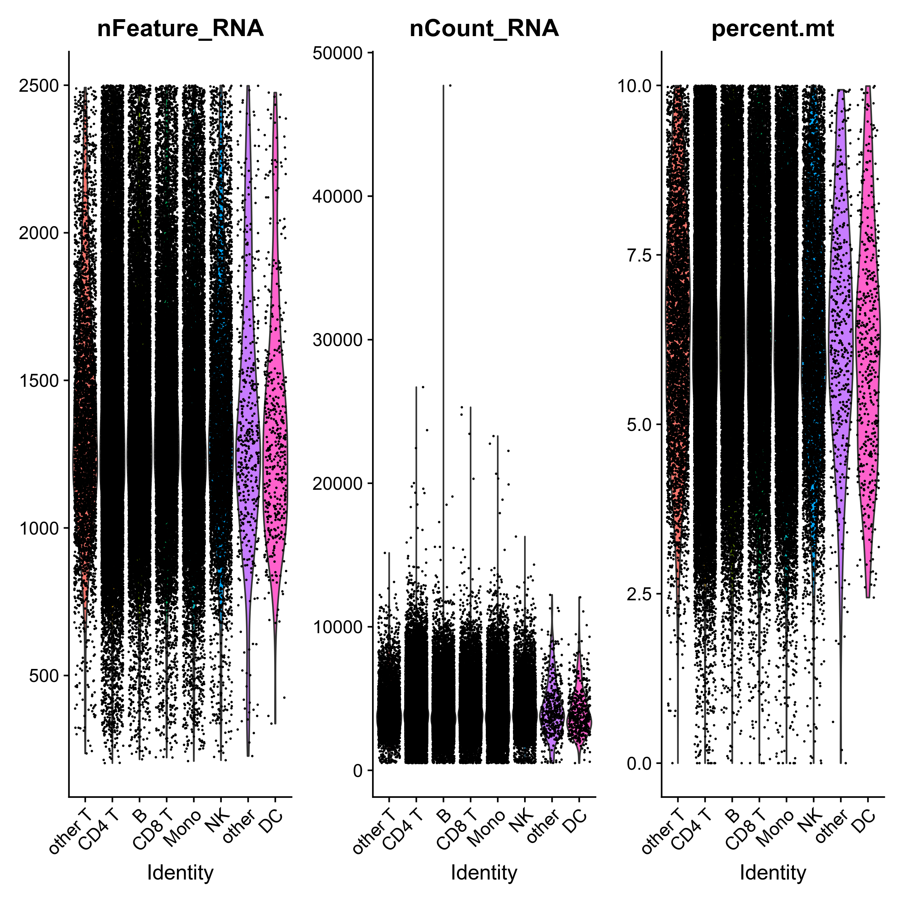
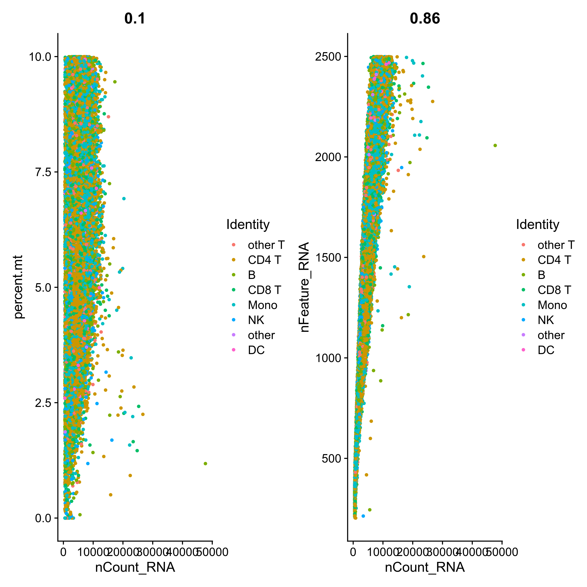

# The Impact of Ethnicity on the Single-cell Immune Response to Falciparum Malaria


This repository conatins the information related to **The Impact of Ethnicity on the Single-cell Immune Response to Falciparum Malaria**.

1. [Data repository](#data-information)
2. [Consortium analysis](#consortium-analysis)
3. [eQTL analysis](#eqtl-analysis)
4. [In house analysis](#independent-unsupervised-clustering)
5. [Comparison between 2 pipelines](#comparison-between-2-pipelines)

---

### Data information

The multiplexed 10x scRNA-seq using the 10x Genomics Chromium with Single Cell 3’ library was sequenced in 2 batches in Illumina NovaSeq 6000 instrument. The sequenced data is subsequently processed using cellranger (3.0.2) by aligning to the human transcriptome(GRCh38-1.2.0) for each pool

```
cellranger count \
--id=Pool007-G7_cellrangerCount \
--fastqs=. \
--sample=Pool007-G7 \
--transcriptome=refdata-cellranger-GRCh38-1.2.0 \
--jobmode=local \
--localcores=14 \
```

Cell ranger output per batch is available via Gene Expression Omnibus

**Batch1:** [GSE273781](https://www.ncbi.nlm.nih.gov/geo/query/acc.cgi?acc=GSE273781)

**Batch2:** [GSE273785](https://www.ncbi.nlm.nih.gov/geo/query/acc.cgi?acc=GSE273785)


---


### Consortium Analysis

**1) Genotype Quality Control and Phasing**
Genotype data was initially quality-controlled by comparison to the 1000 Genomes Project to validate sex and ancestry matches. Phasing of the genotype data was performed using Eagle, and imputation was carried out with Minimac4. The resulting phased and imputed genotype data was used for de-multiplexing samples and identification of doublet within each pool. Detailed information on the pipeline and scripts is defined [here](https://wg1-pipeline-qc.readthedocs.io/en/latest/Imputation/index.html#imputation).


**2) Demultiplexing and Doublet Removal**
Demultiplexing and doublet identification were conducted using multiple tools, including Demuxlet and Scrublet. The initial dataset comprised 33,694 genes across ~196K cells, derived from 2 batches and 32 pools. Droplet-type assignment and associated confidence scores for each cell were computed and reported in output_all_Pools_Asignment.txt for all the different softwares used. Highly confident singlets of ~167K cells were selected for downstream analysis using an intersectional method as outlined in pipeline (results Final_all_Pools_Asignment.txt). Detailed information on the pipeline and scripts is defined [here](https://wg1-pipeline-qc.readthedocs.io/en/latest/Demultiplexing/index.html#demultiplexing).


**3) Cell Type Identification**
Cell type identification was performed using two independent methods: Azimuth (reference-based method within the Seurat framework) and scPred. The results from both methods were merged and compared. Detailed information on the pipeline and scripts is defined [here](https://powellgenomicslab.github.io/WG2-pipeline-classification-docs/).


---

### eQTL analysis

Pesuod bulk was created using the muscate tool (Muscat-DGEA.R)

---

### Independent unsupervised clustering 

The  Demultiplexed and Doublet removed singlecell data was used to perform unsupervised clustering (Louvain method) to identify cell clusters de novo and compare the cells to the Reference based method. We empolyed simmilar QC filtering in both the methods. 










To measure the similarity between two clusterings methods while accounting for chance and differences we ustilized python module `adjusted_rand_score` from the `sklearn.metrics`. 

The script `Harmony.R`  contains the method used for independent clusterings analysis


###################
The data was analysed independently using in-house pipeline to compare the unsupervised clusturing  with reference based method adopted by consortium pipeline. Following bioinformatics method was utilized for the analysis of pooled 10x single cell samples generated across multiple pools and multiple runs.

The analysis includes:


1. Identification of the cells for each samples based on the genotypes
2. Subsetting the highly probable cell and creating seurat object
3. Filtering and Normalization of the subset
4. Clusturing
5. Cell type identification
   

## Step 1: Identification of the cells for each samples based on the genotypes


**1. A filtered vcf was created for each pool from a large cohort**


   - Subset the samples from the main cohort vcf using vcftools
   - Only consider biallellic SNP's that are different in minimum 1 sample
   - Sort the filtered vcf in the samorder as in the bam file using vcf-sort


**2. Running `Demuxlet`**


```
demuxlet --sam pool01/outs/possorted_genome_bam.bam \
--vcf Pool1.Sorted.vcf.gz  --field GT \
--group-list pool01/outs/filtered_gene_bc_matrices/GRCh38/barcodes.tsv \
--cap-BQ 90 --min-uniq 2 \
--out pool1-GT
```

**3. Filtering Demuxlet output**

For downatream analysis we removed any cells that was identified as ambigious or doublets. For this we considered only those cells that was having SNG tag in the demuxlet output `.best`. Downl below is provided with the Summary results from demuxlet 

<details>

<summary>Summary table after demuxlet</summary>


|Sample_ID |scRNA_Batch |scRNA_Pool | Total_Droplets| Droplets_assigned_To_Singlesample| %Singletons_retrived|Doublets |
|:---------|:-----------|:----------|--------------:|-------------------------------------:|-------------------------:|:-------------|
|PAM501    |BATCH1      |Pool1      |           6403|                                  5892|                  92.01937|1451          |
|PAM508    |BATCH1      |Pool1      |           6403|                                  5892|                  92.01937|917           |
|PAM511    |BATCH1      |Pool1      |           6403|                                  5892|                  92.01937|831           |
|PAM539    |BATCH1      |Pool1      |           6403|                                  5892|                  92.01937|764           |
|PAM503    |BATCH1      |Pool2      |           5361|                                  4953|                  92.38948|496           |
|PAM507    |BATCH1      |Pool2      |           5361|                                  4953|                  92.38948|1083          |
|PAM510    |BATCH1      |Pool2      |           5361|                                  4953|                  92.38948|808           |
|PAM538    |BATCH1      |Pool2      |           5361|                                  4953|                  92.38948|773           |
|PAM505    |BATCH1      |Pool3      |           4964|                                  4571|                  92.08300|896           |
|PAM512    |BATCH1      |Pool3      |           4964|                                  4571|                  92.08300|964           |
|PAM502    |BATCH1      |Pool4      |           4842|                                  4438|                  91.65634|834           |
|PAM504    |BATCH1      |Pool4      |           4842|                                  4438|                  91.65634|805           |
|PAM509    |BATCH1      |Pool4      |           4842|                                  4438|                  91.65634|624           |
|PAM528    |BATCH1      |Pool4      |           4842|                                  4438|                  91.65634|951           |
|PAM678    |BATCH1      |Pool5      |           5481|                                  5173|                  94.38059|745           |
|PAM692    |BATCH1      |Pool5      |           5481|                                  5173|                  94.38059|1123          |
|PAM557    |BATCH1      |Pool6      |           5481|                                  5173|                  94.38059|570           |
|PAM560    |BATCH1      |Pool6      |           5481|                                  5173|                  94.38059|1092          |
|PAM572    |BATCH1      |Pool6      |           5481|                                  5173|                  94.38059|735           |
|PAM583    |BATCH1      |Pool6      |           5481|                                  5173|                  94.38059|1000          |
|PAM680    |BATCH1      |Pool6      |           5481|                                  5173|                  94.38059|873           |
|PAM677    |BATCH1      |Pool7      |           6758|                                  6355|                  94.03670|885           |
|PAM679    |BATCH1      |Pool7      |           6758|                                  6355|                  94.03670|1733          |
|PAM688    |BATCH1      |Pool7      |           6758|                                  6355|                  94.03670|1094          |
|PAM690    |BATCH1      |Pool7      |           6758|                                  6355|                  94.03670|713           |
|PAM551    |BATCH1      |Pool8      |           4580|                                  4321|                  94.34498|773           |
|PAM552    |BATCH1      |Pool8      |           4580|                                  4321|                  94.34498|882           |
|PAM559    |BATCH1      |Pool8      |           4580|                                  4321|                  94.34498|490           |
|PAM562    |BATCH1      |Pool8      |           4580|                                  4321|                  94.34498|747           |
|PAM566    |BATCH1      |Pool8      |           4580|                                  4321|                  94.34498|570           |
|PAM581    |BATCH1      |Pool8      |           4580|                                  4321|                  94.34498|859           |
|PAM540    |BATCH1      |Pool9      |           3992|                                  3681|                  92.20942|831           |
|PAM681    |BATCH1      |Pool9      |           3992|                                  3681|                  92.20942|615           |
|PAM682    |BATCH1      |Pool9      |           3992|                                  3681|                  92.20942|393           |
|PAM549    |BATCH1      |Pool10     |           4485|                                  4124|                  91.95095|763           |
|PAM550    |BATCH1      |Pool10     |           4485|                                  4124|                  91.95095|692           |
|PAM553    |BATCH1      |Pool10     |           4485|                                  4124|                  91.95095|638           |
|PAM555    |BATCH1      |Pool10     |           4485|                                  4124|                  91.95095|1075          |
|PAM568    |BATCH1      |Pool10     |           4485|                                  4124|                  91.95095|465           |
|PAM587    |BATCH1      |Pool10     |           4485|                                  4124|                  91.95095|491           |
|PAM693    |BATCH1      |Pool11     |           5775|                                  5313|                  92.00000|691           |
|PAM708    |BATCH1      |Pool11     |           5775|                                  5313|                  92.00000|836           |
|PAM710    |BATCH1      |Pool11     |           5775|                                  5313|                  92.00000|817           |
|PAM567    |BATCH1      |Pool12     |           6704|                                  5491|                  81.90632|676           |
|PAM570    |BATCH1      |Pool12     |           6704|                                  5491|                  81.90632|897           |
|PAM577    |BATCH1      |Pool12     |           6704|                                  5491|                  81.90632|1043          |
|PAM578    |BATCH1      |Pool12     |           6704|                                  5491|                  81.90632|410           |
|PAM584    |BATCH1      |Pool12     |           6704|                                  5491|                  81.90632|1014          |
|PAM765    |BATCH1      |Pool13     |           4959|                                  3943|                  79.51200|781           |
|PAM787    |BATCH1      |Pool13     |           4959|                                  3943|                  79.51200|595           |
|PAM683    |BATCH1      |Pool14     |           4160|                                  3953|                  95.02404|707           |
|PAM689    |BATCH1      |Pool14     |           4160|                                  3953|                  95.02404|536           |
|PAM789    |BATCH1      |Pool14     |           4160|                                  3953|                  95.02404|310           |
|PAM563    |BATCH1      |Pool15     |           4814|                                  4541|                  94.32904|351           |
|PAM564    |BATCH1      |Pool15     |           4814|                                  4541|                  94.32904|828           |
|PAM575    |BATCH1      |Pool15     |           4814|                                  4541|                  94.32904|1231          |
|PAM579    |BATCH1      |Pool15     |           4814|                                  4541|                  94.32904|771           |
|PAM580    |BATCH1      |Pool15     |           4814|                                  4541|                  94.32904|719           |
|PAM554    |BATCH1      |Pool16     |           4177|                                  3973|                  95.11611|984           |
|PAM561    |BATCH1      |Pool16     |           4177|                                  3973|                  95.11611|921           |
|PAM571    |BATCH1      |Pool16     |           4177|                                  3973|                  95.11611|511           |
|PAM574    |BATCH1      |Pool16     |           4177|                                  3973|                  95.11611|386           |
|PAM582    |BATCH1      |Pool16     |           4177|                                  3973|                  95.11611|673           |
|PAM623    |BATCH1      |Pool16     |           4177|                                  3973|                  95.11611|498           |
|PAM565    |BATCH2      |Pool1      |           6484|                                  6102|                  94.10858|767           |
|PAM586    |BATCH2      |Pool1      |           6484|                                  6102|                  94.10858|1540          |
|PAM761    |BATCH2      |Pool2      |           6706|                                  6327|                  94.34834|1196          |
|PAM770    |BATCH2      |Pool2      |           6706|                                  6327|                  94.34834|1130          |
|PAM776    |BATCH2      |Pool2      |           6706|                                  6327|                  94.34834|1127          |
|PAM782    |BATCH2      |Pool2      |           6706|                                  6327|                  94.34834|1312          |
|PAM783    |BATCH2      |Pool2      |           6706|                                  6327|                  94.34834|779           |
|PAM795    |BATCH2      |Pool2      |           6706|                                  6327|                  94.34834|783           |
|PAM714    |BATCH2      |Pool4      |           5759|                                  5410|                  93.93992|856           |
|PAM718    |BATCH2      |Pool4      |           5759|                                  5410|                  93.93992|734           |
|PAM764    |BATCH2      |Pool4      |           5759|                                  5410|                  93.93992|1177          |
|PAM766    |BATCH2      |Pool4      |           5759|                                  5410|                  93.93992|900           |
|PAM773    |BATCH2      |Pool4      |           5759|                                  5410|                  93.93992|814           |
|PAM798    |BATCH2      |Pool4      |           5759|                                  5410|                  93.93992|929           |
|PAM720    |BATCH2      |Pool6      |           7507|                                  6983|                  93.01985|1297          |
|PAM756    |BATCH2      |Pool6      |           7507|                                  6983|                  93.01985|1091          |
|PAM763    |BATCH2      |Pool6      |           7507|                                  6983|                  93.01985|889           |
|PAM768    |BATCH2      |Pool6      |           7507|                                  6983|                  93.01985|1135          |
|PAM781    |BATCH2      |Pool6      |           7507|                                  6983|                  93.01985|1295          |
|PAM785    |BATCH2      |Pool6      |           7507|                                  6983|                  93.01985|1276          |
|PAM595    |BATCH2      |Pool7      |           6789|                                  6250|                  92.06069|1358          |
|PAM597    |BATCH2      |Pool7      |           6789|                                  6250|                  92.06069|860           |
|PAM600    |BATCH2      |Pool7      |           6789|                                  6250|                  92.06069|1921          |
|PAM727    |BATCH2      |Pool8      |          11989|                                 11235|                  93.71090|1562          |
|PAM759    |BATCH2      |Pool8      |          11989|                                 11235|                  93.71090|3667          |
|PAM775    |BATCH2      |Pool8      |          11989|                                 11235|                  93.71090|1492          |
|PAM762    |BATCH2      |Pool9      |           7093|                                  6564|                  92.54194|1537          |
|PAM774    |BATCH2      |Pool9      |           7093|                                  6564|                  92.54194|896           |
|PAM794    |BATCH2      |Pool9      |           7093|                                  6564|                  92.54194|792           |
|PAM601    |BATCH2      |Pool10     |           6484|                                  5796|                  89.38927|1185          |
|PAM602    |BATCH2      |Pool10     |           6484|                                  5796|                  89.38927|1011          |
|PAM609    |BATCH2      |Pool10     |           6484|                                  5796|                  89.38927|1400          |
|PAM611    |BATCH2      |Pool10     |           6484|                                  5796|                  89.38927|1175          |
|PAM793    |BATCH2      |Pool10     |           6484|                                  5796|                  89.38927|4             |
|PAM754    |BATCH2      |Pool11     |           7454|                                  6683|                  89.65656|838           |
|PAM771    |BATCH2      |Pool11     |           7454|                                  6683|                  89.65656|3169          |
|PAM784    |BATCH2      |Pool11     |           7454|                                  6683|                  89.65656|753           |
|PAM788    |BATCH2      |Pool11     |           7454|                                  6683|                  89.65656|512           |
|PAM799    |BATCH2      |Pool11     |           7454|                                  6683|                  89.65656|1055          |
|PAM592    |BATCH2      |Pool12     |           7400|                                  6797|                  91.85135|1595          |
|PAM594    |BATCH2      |Pool12     |           7400|                                  6797|                  91.85135|890           |
|PAM598    |BATCH2      |Pool12     |           7400|                                  6797|                  91.85135|1556          |
|PAM599    |BATCH2      |Pool12     |           7400|                                  6797|                  91.85135|1105          |
|PAM603    |BATCH2      |Pool12     |           7400|                                  6797|                  91.85135|628           |
|PAM731    |BATCH2      |Pool13     |           5820|                                  5434|                  93.36770|2156          |
|PAM760    |BATCH2      |Pool13     |           5820|                                  5434|                  93.36770|837           |
|PAM626    |BATCH2      |Pool14     |           7150|                                  6702|                  93.73427|1289          |
|PAM635    |BATCH2      |Pool14     |           7150|                                  6702|                  93.73427|935           |
|PAM636    |BATCH2      |Pool14     |           7150|                                  6702|                  93.73427|953           |
|PAM643    |BATCH2      |Pool14     |           7150|                                  6702|                  93.73427|1102          |
|PAM617    |BATCH2      |Pool15     |           6587|                                  6124|                  92.97100|808           |
|PAM772    |BATCH2      |Pool15     |           6587|                                  6124|                  92.97100|1085          |
|PAM596    |BATCH2      |Pool16     |           6957|                                  5425|                  77.97901|1922          |
|PAM640    |BATCH2      |Pool16     |           6957|                                  5425|                  77.97901|539           |
|PAM576    |BATCH2      |Pool1      |           6484|                                  6102|                  94.10858|1484          |
|PAM576    |BATCH2      |Pool14     |           7150|                                  6702|                  93.73427|1168          |
|PAM614    |BATCH2      |Pool12     |           7400|                                  6797|                  91.85135|1023          |
|PAM757    |BATCH2      |Pool8      |          11989|                                 11235|                  93.71090|1349          |
|PAM769    |BATCH2      |Pool8      |          11989|                                 11235|                  93.71090|1003          |
|PAM725    |BATCH2      |Pool9      |           7093|                                  6564|                  92.54194|1243          |
|PAM755    |BATCH2      |Pool9      |           7093|                                  6564|                  92.54194|1047          |
|PAM573    |BATCH2      |Pool10     |           6484|                                  5796|                  89.38927|1021          |
|PAM614    |BATCH2      |Pool14     |           7150|                                  6702|                  93.73427|1255          |
|PAM757    |BATCH2      |Pool15     |           6587|                                  6124|                  92.97100|824           |
|PAM769    |BATCH2      |Pool15     |           6587|                                  6124|                  92.97100|856           |
|PAM725    |BATCH2      |Pool15     |           6587|                                  6124|                  92.97100|1690          |
|PAM755    |BATCH2      |Pool15     |           6587|                                  6124|                  92.97100|861           |
|PAM573    |BATCH1      |Pool15     |           4814|                                  4541|                  94.32904|641           |
|PAM711    |BATCH1      |Pool14     |           4160|                                  3953|                  95.02404|505           |


</details>

## Step 2: Subsetting the highly probable cell and creating seurat object

**Per Sample Object**

The below steps was repaeated for all the samples across all the pools and batches.

```
pool.data <- Read10X(data.dir ="MFHKDMXX/Pool001_cellrangerCount/outs/filtered_feature_bc_matrix/")
pool<-NULL;
pool<- CreateSeuratObject(counts = pool.data, project = "SC", min.cells = 3, min.features = 200)
SAMBCPAM501<-read.table("..PAM501_BC.txt",header=FALSE)
pool.vectorPAM501<-SAMBCPAM501[,"V1"]
SAM_poolPAM501<-subset(pool,cell=pool.vectorPAM501)
saveRDS (SAM_poolPAM501, file="PAM501.Rds")

```

**Creating Per pool Seurat object**

The below steps was repaeated for all the samples across all the pools foreach batch .

```
CombinedPoolPool001 <- merge(SAM_poolPAM501, y=c(SAM_poolPAM522 ,SAM_poolPAM508 ,SAM_poolPAM511 ,SAM_poolPAM518 ,SAM_poolPAM539), add.cell.ids = c("B1-Pool001-PAM501" ,"B1-Pool001-PAM522" ,"B1-Pool001-PAM508" ,"B1-Pool001-PAM511" ,"B1-Pool001-PAM518" ,"B1-Pool001-PAM539"))
saveRDS (CombinedPoolPool001, file="CombinedPoolPool001.Rds")

```


**Batch 1 Samples**

All the pools were mereged  as a single batch

```
Pool1.1 <- readRDS("BATCH1/CombinedPoolPool001.Rds")
Pool10.1  <- readRDS("BATCH1/CombinedPoolPool010.Rds")
Pool11.1  <- readRDS("BATCH1/CombinedPoolPool011.Rds")
Pool12.1  <- readRDS("BATCH1/CombinedPoolPool012.Rds")
Pool13.1  <- readRDS("BATCH1/CombinedPoolPool013.Rds")
Pool14.1  <- readRDS("BATCH1/CombinedPoolPool014.Rds")
Pool15.1  <- readRDS("BATCH1/CombinedPoolPool015.Rds")
Pool16.1  <- readRDS("BATCH1/CombinedPoolPool016.Rds")
Pool2.1  <- readRDS("BATCH1/CombinedPoolPool002.Rds")
Pool3.1  <- readRDS("BATCH1/CombinedPoolPool003.Rds")
Pool4.1  <- readRDS("BATCH1/CombinedPoolPool004.Rds")
Pool5.1  <- readRDS("BATCH1/CombinedPoolPool005.Rds")
Pool6.1  <- readRDS("BATCH1/CombinedPoolPool006.Rds")
Pool7.1  <- readRDS("BATCH1/CombinedPoolPool007.Rds")
Pool8.1  <- readRDS("BATCH1/CombinedPoolPool008.Rds")
Pool9.1  <- readRDS("BATCH1/CombinedPoolPool009.Rds")

Pool1.1 @meta.data[,"PoolID"] <- "Pool1"
Pool10.1 @meta.data[,"PoolID"] <- "Pool10"
Pool11.1 @meta.data[,"PoolID"] <- "Pool11"
Pool12.1 @meta.data[,"PoolID"] <- "Pool12"
Pool13.1 @meta.data[,"PoolID"] <- "Pool13"
Pool14.1 @meta.data[,"PoolID"] <- "Pool14"
Pool15.1 @meta.data[,"PoolID"] <-  "Pool15"
Pool16.1 @meta.data[,"PoolID"] <- "Pool16"
Pool2.1 @meta.data[,"PoolID"] <- "Pool2"
Pool3.1 @meta.data[,"PoolID"] <- "Pool3"
Pool4.1 @meta.data[,"PoolID"] <- "Pool4"
Pool5.1 @meta.data[,"PoolID"] <- "Pool5"
Pool6.1 @meta.data[,"PoolID"] <- "Pool6"
Pool7.1 @meta.data[,"PoolID"] <- "Pool7"
Pool8.1 @meta.data[,"PoolID"] <-  "Pool8"
Pool9.1 @meta.data[,"PoolID"] <- "Pool9"

Pool1.2 <- readRDS("BATCH2/CombinedPoolPool1.Rds")
Pool2.2 <- readRDS("BATCH2/CombinedPoolPool2.Rds")
Pool3.2 <- readRDS("BATCH2/CombinedPoolPool3.Rds")
Pool4.2 <- readRDS("BATCH2/CombinedPoolPool4.Rds")
Pool5.2 <- readRDS("BATCH2/CombinedPoolPool5.Rds")
Pool6.2 <- readRDS("BATCH2/CombinedPoolPool6.Rds")
Pool7.2 <- readRDS("BATCH2/CombinedPoolPool7.Rds")
Pool8.2 <- readRDS("BATCH2/CombinedPoolPool8.Rds")
Pool9.2 <- readRDS("BATCH2/CombinedPoolPool9.Rds")
Pool10.2 <- readRDS("BATCH2/CombinedPoolPool10.Rds")
Pool11.2 <- readRDS("BATCH2/CombinedPoolPool11.Rds")
Pool12.2 <- readRDS("BATCH2/CombinedPoolPool12.Rds")
Pool13.2 <- readRDS("BATCH2/CombinedPoolPool13.Rds")
Pool14.2 <- readRDS("BATCH2/CombinedPoolPool14.Rds")
Pool15.2 <- readRDS("BATCH2/CombinedPoolPool15.Rds")
Pool16.2 <- readRDS("BATCH2/CombinedPoolPool16.Rds")
```

**Batch 2 Samples**
All the pools were mereged  as a single batch


```
Pool1.2@meta.data[,"PoolID"] <- "Pool1"
Pool2.2@meta.data[,"PoolID"] <- "Pool2"
Pool3.2@meta.data[,"PoolID"] <- "Pool3"
Pool4.2@meta.data[,"PoolID"] <- "Pool4"
Pool5.2@meta.data[,"PoolID"] <- "Pool5"
Pool6.2@meta.data[,"PoolID"] <- "Pool6"
Pool7.2@meta.data[,"PoolID"] <- "Pool7"
Pool8.2@meta.data[,"PoolID"] <-  "Pool8"
Pool9.2@meta.data[,"PoolID"] <- "Pool9"
Pool10.2@meta.data[,"PoolID"] <- "Pool10"
Pool11.2@meta.data[,"PoolID"] <- "Pool11"
Pool12.2@meta.data[,"PoolID"] <- "Pool12"
Pool13.2@meta.data[,"PoolID"] <- "Pool13"
Pool14.2@meta.data[,"PoolID"] <- "Pool14"
Pool15.2@meta.data[,"PoolID"] <-  "Pool15"
Pool16.2@meta.data[,"PoolID"] <- "Pool16"

```

**Merging Batch 1 & Batch 2 Samples**

Both the curated batches were merged as a single batch
```
pag.combined<- merge(Pool1.1, y=c(Pool2.1, Pool3.1, Pool4.1, Pool5.1,Pool6.1,Pool7.1,Pool8.1,Pool9.1,Pool10.1,Pool11.1,Pool12.1,Pool13.1,Pool14.1,Pool15.1,Pool16.1, Pool1.2, Pool2.2, Pool3.2, Pool4.2, Pool5.2,Pool6.2,Pool7.2,Pool8.2,Pool9.2,Pool10.2,Pool11.2,Pool12.2,Pool13.2,Pool14.2,Pool15.2,Pool16.2),project ="AllSamplesCombined")
saveRDS (pag.combined, file="Batch1_2Samples.Rds")

```

## Step 3: Filtering and Normalization of the subset

```
seurat_object_subset <- readRDS("Batch1_2Samples.Rds")
seurat_object_subset$Batch_Pool <- paste(seurat_object_subset$Batch, seurat_object_subset$PoolID, sep = "_")


# Pre-QC Plots
pag.combined <- PercentageFeatureSet(seurat_object_subset, pattern = "^MT-", col.name = 'percent.mt', assay = "RNA")

png("Raw_ViolinPlot.png", width = 2500, height = 2500, res = 300)
VlnPlot(pag.combined, features = c("nFeature_RNA", "nCount_RNA", "percent.mt"), ncol = 3)
dev.off()

png("Raw_FeaturePlot.png", width = 2500, height = 2500, res = 300)
FeatureScatter(pag.combined, feature1 = "nCount_RNA", feature2 = "percent.mt") +
  FeatureScatter(pag.combined, feature1 = "nCount_RNA", feature2 = "nFeature_RNA")
dev.off()

pag.combined <- NULL

# Step 1. Split Seurat object by Batch and Pool for normalization for the differenc in cells per sample and per pool
combined_list <- SplitObject(seurat_object_subset, split.by = "Batch_Pool")

```


**Filtering**

```
# QC thresholds
nFeature_low <- 500;   nFeature_high <- 2500;   percent_mt_high <- 10;   nCount_high <- 20000

# Add mitochondrial percentage and filter
combined_list <- lapply(combined_list, function(x) {
  x <- PercentageFeatureSet(x, pattern = "^MT-", col.name = 'percent.mt')
  x <- subset(x, subset = nFeature_RNA > nFeature_low & nFeature_RNA < nFeature_high &
                       nCount_RNA < nCount_high & percent.mt < percent_mt_high)
  return(x)
})
```


**Normalize with SCTransform**

```
# Step 2: Normalize with SCTransform and run PCA
combined_list <- lapply(combined_list, function(x) {
  x <- SCTransform(x, verbose = FALSE, vars.to.regress = c("percent.mt", "nFeature_RNA"), return.only.var.genes = FALSE)  # Normalize all genes
  x <- RunPCA(x, verbose = FALSE)  # PCA
  return(x)
})

# Step 2.5: Select integration features that exist across all objects
features <- SelectIntegrationFeatures(object.list = combined_list, nfeatures = 2000)

# Verify features are in scale.data for each object in combined_list
validated_features <- features
for (i in seq_along(combined_list)) {
  available_features <- rownames(GetAssayData(combined_list[[i]], slot = "scale.data"))
  validated_features <- intersect(validated_features, available_features)
}

```
   
## Step 4: Clusturing

```
# Step 3: Feature Selection & Integration
combined_list <- PrepSCTIntegration(object.list = combined_list, anchor.features = validated_features)
seurat_combined <- merge(combined_list[[1]], y = combined_list[-1])
VariableFeatures(seurat_combined) <- validated_features
# Set Default Assay and Run PCA
DefaultAssay(seurat_combined) <- "SCT"
seurat_combined <- RunPCA(seurat_combined, npcs = 50, verbose = FALSE)
```

**harmonize single-cell by correcting for batch effects and other variations**

```
seurat_combined <- RunHarmony(
    object = seurat_combined, 
    group.by.vars = "Batch_Pool",
    assay.use = "SCT",
    reduction.use = "pca",
    dims = 1:30,
    verbose = FALSE,
    theta = 2
)
```
**UMAP & Clusturing**

```
seurat_combined <- RunUMAP(seurat_combined, reduction = "harmony", dims = 1:30, min.dist = 0.5, n.neighbors = 50L)
seurat_combined <- FindNeighbors(seurat_combined, reduction = "harmony", dims = 1:30)
seurat_combined <- FindClusters(seurat_combined, resolution = 0.6)

DimPlot(seurat_combined, reduction = "umap", group.by = "seurat_clusters")
```


### Comparison between 2 pipelines

To measure the similarity between two clusterings methods while accounting for chance and differences we ustilized python module `adjusted_rand_score` from the `sklearn.metrics`. 

**Reading the Seurat objects from 2 Methods**
```
# Step 1 Reading the Outputput from both the run
seurat_combined <- readRDS("Harmony.Rds")
Idents(seurat_combined) <- "seurat_clusters"

## Reading filterd consortium
Consortium<-readRDS("cons_data_filtered_125.RDS")
Idents(Consortium) <- "predicted.celltype.l2"
```
**Fixing the cell names for comparison between 2 methods**

```
consortium_cells <- colnames(Consortium)
consortium_metadata <- Consortium@meta.data

consortium_new_cell_names <- paste0(
  "B", consortium_metadata$scRNA_Batch,
  "-Pool", sprintf("%03d", as.numeric(gsub("Pool", "", consortium_metadata$Pool))), # Force three-digit format
  "-", consortium_metadata$Assignment, 
  "_", sapply(strsplit(rownames(consortium_metadata), "_"), `[`, 1),
  "-1"
)
Consortium <- RenameCells(Consortium, new.names = consortium_new_cell_names)
```

**Obtain common cells for comaprison**

```
common_cells <- intersect(colnames(seurat_combined), colnames(Consortium))
harmony_clusters <- as.vector(Idents(seurat_combined)[common_cells])
Consortium_clusters <- as.vector(Idents(Consortium)[common_cells])
filtered_clusters <- tolower(Consortium_clusters)

df <- data.frame(cell = common_cells, harmony_clusters, filtered_clusters)
write.csv(df, "common_cluster_assignments.csv", row.names = FALSE)

```

`24,988` common cells between the two Seurat objects (seurat_combined with `99,257 `cells and Consortium with `71,784` cells)

**Running adjusted_rand_score**

Following Python commands was run for the comparison
```
import pandas as pd
from sklearn.metrics import adjusted_rand_score
df = pd.read_csv("common_cluster_assignments.csv")
harmony_clusters = df['harmony_clusters']
filtered_clusters = df['filtered_clusters']

# Calculate Adjusted Rand Index
ari_score = adjusted_rand_score(harmony_clusters, filtered_clusters)
print(f"Adjusted Rand Index: {ari_score}")
```

We obtained the following score by comparing the clusturing using inhouse method with predicted celltype level 2 of  **adjusted Rand Index:** `0.5844902789189855` 

**Creating output**
```
contingency_table = pd.crosstab(harmony_clusters, filtered_clusters)
contingency_table.to_excel("contingency_table.xlsx", sheet_name="Cluster Comparison")
```

      

